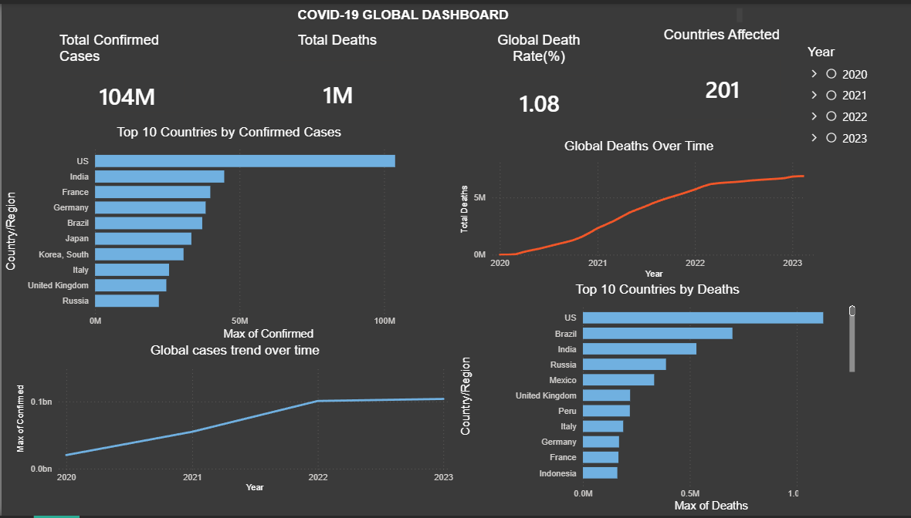

# COVID-19 Global Dashboard

## Dashboard Preview


---

## Project Objective
Analyze global COVID-19 data to uncover trends, identify the most affected countries, and communicate key insights through an interactive Power BI dashboard. This project was completed as part of the **AnalystLab Africa Data Analytics Internship Program — Week 4.**

---

## Dataset
- **Source:** Johns Hopkins University Center for Systems Science and Engineering (JHU CSSE)
- **GitHub:** [CSSEGISandData/COVID-19](https://github.com/CSSEGISandData/COVID-19)
- **Files used:**
  - `time_series_covid19_confirmed_global.csv` — Daily cumulative confirmed cases by country
  - `time_series_covid19_deaths_global.csv` — Daily cumulative deaths by country
- **Coverage:** January 22, 2020 – March 9, 2023
- **Scope:** 201 countries and territories

---

## Tools Used
- **Python (Google Colab)** — Data cleaning and EDA
- **pandas** — Data manipulation and reshaping
- **Power BI** — Interactive dashboard and DAX measures
- **GitHub** — Version control and project documentation

---

## Data Cleaning Steps
1. Loaded both raw CSV files and explored structure, shape, and missing values
2. Dropped 2 non-geographic rows — "Repatriated Travellers" (Canada) and "Unknown" (China) — which had no Lat/Long coordinates
3. Filled missing `Province/State` values with the corresponding `Country/Region` name (198 rows affected — expected, as most countries report as one unit)
4. Melted both datasets from wide format (1,143 date columns) to long format (one row per country per day) so Power BI could read dates properly
5. Merged confirmed cases and deaths into one unified table on Country/Region and Date
6. Grouped by Country/Region and Date to combine province-level data (e.g. China's 30+ provinces) into single country rows
7. Added calculated columns:
   - `Death_Rate_%` — Deaths ÷ Confirmed × 100
   - `Year`, `Month`, `Month_Name` — for Power BI time filters
8. Verified zero nulls and zero negative values in the final clean file
9. Exported as `global_covid_clean.csv` — 229,743 rows, 8 columns, zero missing values

---

## Key Findings
- **104M** total confirmed cases globally as of March 2023
- **1M+** total deaths recorded across 201 countries and territories
- **1.08%** global death rate
- The **US, India and France** recorded the highest confirmed case counts
- The **US and Brazil** led in total deaths
- The death trend chart clearly shows three pandemic waves — the initial outbreak in early 2020, the Delta surge in late 2021, and the Omicron peak in early 2022
- Despite the US having the most confirmed cases, Brazil had a proportionally higher death toll — suggesting differences in healthcare capacity and reporting
- The dataset tracks 201 countries and territories — not 196 — because regions like Hong Kong, Greenland and various overseas territories are reported separately from their parent countries

---

## Dashboard Features
Built in Power BI with a dark theme

**KPI Cards:**
- Total Confirmed Cases
- Total Deaths
- Global Death Rate (%)
- Countries & Territories Affected

**Charts:**
- Top 10 Countries by Confirmed Cases (bar chart)
- Top 10 Countries by Deaths (bar chart)
- Global Cases Trend Over Time (line chart)
- Global Deaths Over Time (line chart)

**Interactivity:**
- Year slicer (2020, 2021, 2022, 2023)
- Country/Region dropdown filter

---

## DAX Measures Used
```
Total Confirmed Cases =
SUMX(
    VALUES('global_covid_clean'[Country/Region]),
    MAXX(
        FILTER('global_covid_clean', 'global_covid_clean'[Country/Region] = EARLIER('global_covid_clean'[Country/Region])),
        'global_covid_clean'[Confirmed]
    )
)

Total Deaths =
SUMX(
    VALUES('global_covid_clean'[Country/Region]),
    MAXX(
        FILTER('global_covid_clean', 'global_covid_clean'[Country/Region] = EARLIER('global_covid_clean'[Country/Region])),
        'global_covid_clean'[Deaths]
    )
)

Global Death Rate =
DIVIDE(
    MAXX(ALLSELECTED('global_covid_clean'), 'global_covid_clean'[Deaths]),
    MAXX(ALLSELECTED('global_covid_clean'), 'global_covid_clean'[Confirmed]),
    0
) * 100

Countries Affected = DISTINCTCOUNT('global_covid_clean'[Country/Region])
```

---

## How to Run
1. Clone this repository
2. Open `covid19_global_eda_cleaning.ipynb` in Google Colab or Jupyter Notebook
3. Upload the two raw CSV files from the JHU CSSE GitHub repository
4. Run all cells — the clean file `global_covid_clean.csv` will be exported
5. Open `covid19.pbix` in Power BI Desktop to explore the dashboard

---

## Author
**Naomi Sirya**
GitHub: [@umiSirya](https://github.com/umiSirya)
AnalystLab Africa Data Analytics Internship — Batch B (June – August 2025)
